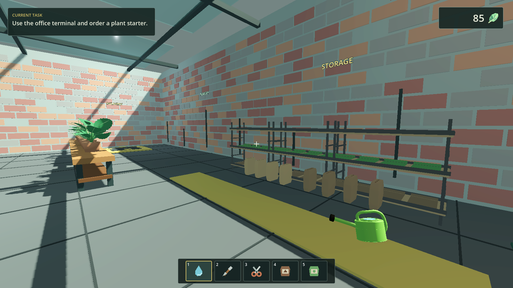
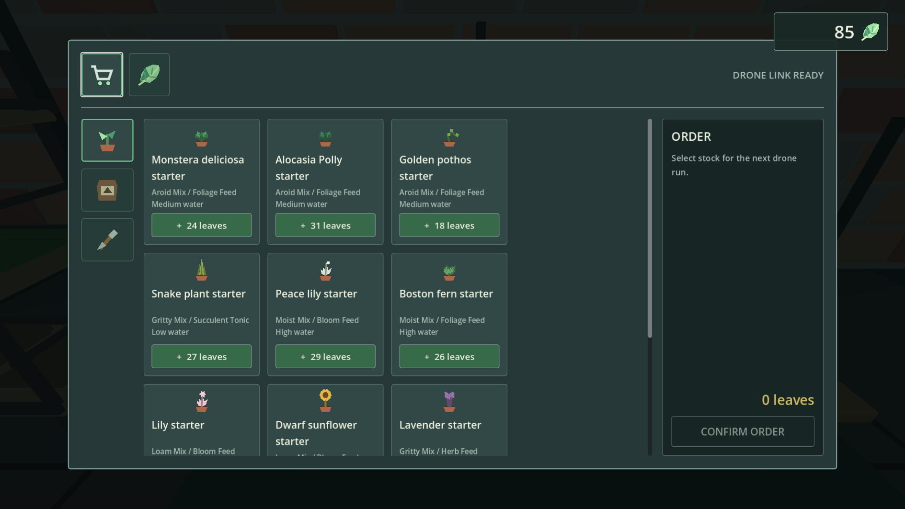
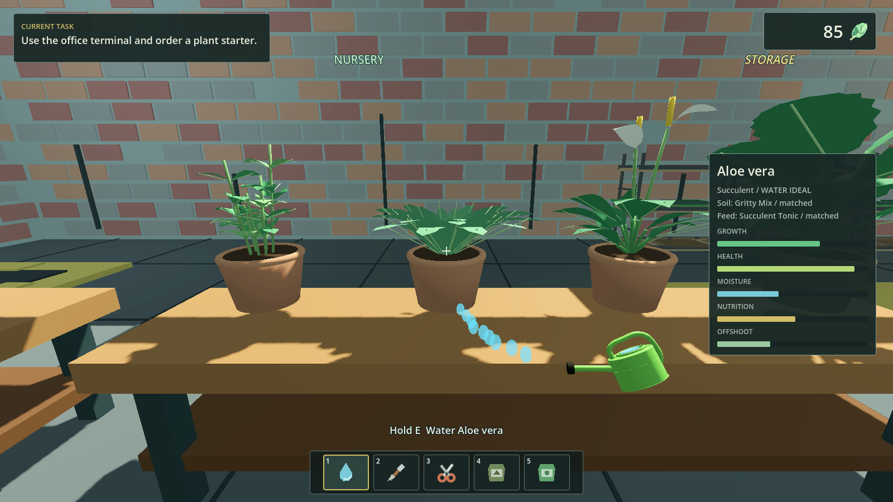

# Isolated Greenhouse

[](https://github.com/EasyEddi/Isolated-Greenhouse-Simulator/actions/workflows/validate.yml)

Isolated Greenhouse is a calm first-person plant-care and greenhouse-management simulator. It is a standalone reimplementation focused on one polished loop: order supplies, receive a drone delivery, prepare species-appropriate pots, grow and care for plants, harvest offshoots, and sell them to expand the nursery.



## Current Slice

- Twelve distinct plant species with continuous model growth and individual water, soil, and feed requirements.
- A physical first-person loop spanning the office, storage, nursery, greenhouse, utility sink, and delivery bay.
- Twelve individual shelf slots for visibly storing and retrieving supplies, equipment, and plant stock without item loss.
- A fixed-camera online terminal, cart, categorized stock, leaf currency, and animated drone deliveries.
- Press-and-hold watering, recoverable drought and overwatering stress, fertilizer compatibility, and persistent plant health.
- Mature offshoot harvesting and sales, including rare persistent variegation with premium value.
- Autosave, manual save, continue, inventory, plant journal, objective guidance, audio, and pause settings.





## Play

The packaged Windows build is produced at `build/IsolatedGreenhouse_0.1.0.exe`.

Core controls:

- `WASD`: Move
- Mouse: Look
- `E`: Interact / use selected item
- `F`: Use or leave the shop terminal
- `1`-`5` or mouse wheel: Select hotbar item
- `Tab`: Open inventory and plant journal
- `Esc`: Pause or close the current screen

## Development

The project targets Godot `4.6.3-stable` and uses GDScript. It is intentionally buildable and testable from the command line.

```powershell
godot --headless --path . --editor --quit
godot --headless --path . --script res://tests/run_tests.gd
godot --headless --path . --script res://tests/run_integration_tests.gd
godot --headless --path . --export-release "Windows Desktop" build/IsolatedGreenhouse_0.1.0.exe
```

See [Documentation/DESIGN-BIBLE.md](Documentation/DESIGN-BIBLE.md) for the gameplay scope, [Documentation/TECHNICAL.md](Documentation/TECHNICAL.md) for architecture, and [Documentation/QA-REPORT.md](Documentation/QA-REPORT.md) for the verified release gates.
